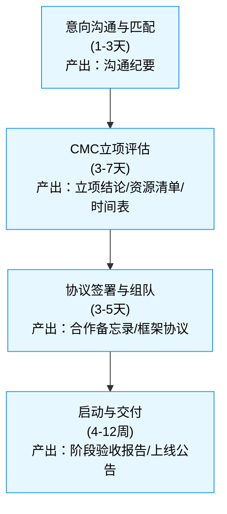

# 社区合作项目发起说明（供潜在主理人阅读）

面向希望与社区共同发起公益类智能助手/数字化项目的主理人（医生/志愿者/机构伙伴）。本说明用于帮助您快速了解流程、角色分工、资源支持、知识产权与数据权属、合规与退出机制等关键信息，便于您判断是否合作及如何落地。

## 1️⃣ 流程概览（从意向到上线）
1. 意向沟通与匹配（1-3天）：了解目标人群与问题、判断是否符合公益与合规边界；产出《沟通纪要》
2. 立项评估（3-7天）：方案评审、资源测算、风险评估；产出《立项结论+资源清单+时间表》
3. 协议签署与组队（3-5天）：明确角色与分工、里程碑与验收口径；产出《合作备忘录/框架协议》
4. 启动与交付（4-12周）：按里程碑推进建设与验收；产出《阶段验收报告/上线公告》




## 2️⃣ 角色与分工
- 社区负责：
  - 技术平台与工具链（RAG/知识库、Web/微信接入、基础运维）
  - 开源代码与应用授权、模型调用与LLM Token额度（按项目核定）
  - PR宣传与志愿者招募支持、方法论与项目管理支持
  - 合规与安全建议、基础监测与风控配置
- 主理人/合作方负责：
  - 明确服务对象与应用场景、主导业务需求与优先级
  - 提供与沉淀内容素材、共建知识库、参与事实核验
  - 负责日常运营（社群/内容/反馈收集）与部分知识库维护
  - 遵守公益与合规边界，保障使用者权益
- 主理人资格要求（需满足）：
  - 能够发起并持续投入时间与精力（长期稳定参与）
  - 具备优秀的领导力：能团结、组织和激励团队；与社区（CMC）保持主动沟通并积极推进
  - 身心健康，无重大躯体或心理疾病；如有特殊情况，需由健康合作者共同发起并承担关键职责

## 3️⃣ 资源支持（按立项结果核定）
- 技术：RAG平台、检索与评测工具、Web/微信接入能力、监控面板
- 资产：开源代码与应用授权、组件模版与最佳实践
- 算力：模型调用与LLM Token额度（设定上限/配额，透明统计）
- 运营：PR与传播渠道支持、志愿者招募协助、知识库整理方法论
- 合规：隐私保护建议、合规清单与自查模板、风险提示语模板

## 4️⃣ 合作边界与公益原则（必须满足）
- 100%公益：不得向终端用户收费或变相收费，不得商业引流或交易
- 数据最小化：不采集个人身份敏感数据；确需收集的，由合作方依法合规处理
- 公开透明：项目范围、资源投入与限制、数据与模型使用范围可被说明与追溯

## 5️⃣ 知识产权（IP）与数据权属
- 代码/模型/Prompt：
  - 社区既有与通用组件按社区开源协议提供（以双方签署的协议/备忘录为准）
  - 项目期间定制开发部分的归属与许可方式在协议中明确（开源/共享/限定授权等）
- 品牌与商标：项目名称与视觉资产的使用需经权利人授权；对外传播口径由双方确认
- 数据与隐私：业务数据归属合作方及/或最终用户；社区仅在合规前提下用于运维与模型迭代，不进行对外交易
- 成果发表：论文/报告/案例对外发布时遵循署名规范与审阅流程

## 6️⃣ 里程碑与验收示例（可按项目调整）
- M0 立项通过：目标、范围、角色、资源与时间表确认
- M1 原型就绪（2-4周）：基础问答/知识库最小可用版本、内测通过
- M2 上线试运行（4-8周）：Web/微信接入、监控与反馈闭环、风险提示上线
- M3 评估与扩展（8-12周）：效果评估、知识库完善、是否进入二期评审

## 7️⃣ 风险、合规与退出机制
- 风险识别：医疗/隐私/版权/品牌等风险清单与应对预案
- 暂停与终止：出现重大合规风险、公益原则被破坏或资源不足时，可暂停或终止
- 退出处置：代码与数据的去向、账号与权限回收、对外说明口径
- 争议解决：协商为先，无法解决时按协议约定的管辖与规则处理

## 8️⃣ 提交流程与所需材料
- 提交《项目申请表》，包含：
  - 项目名称、主理人与机构信息、联系人与渠道
  - 目标人群与痛点、拟提供能力与边界
  - 阶段目标与关键里程碑、成功指标
  - 现有资源与诉求（内容、团队、渠道、合规配合）
  - 风险自评与合规承诺、对外品牌与知识产权声明
- 提交方式：发送至指定邮箱/表单（例如：<contact@example.org>），3-5个工作日内答复

## 9️⃣ 常见问题（FAQ）
- 是否独占合作？不是。社区支持多项目并行，避免资源冲突
- 是否可商用？以公益为前提；商用/增值需另行评估与签署
- 是否支持医院/公益组织？优先；同时欢迎医护个人，病友社群发起人，个人和志愿团队申请
- 是否必须自有团队？建议至少3人（主理人，运营，内容），社区可协助补位

---

## 附：项目申请表模板（可复制）
```
项目名称：
主理人/机构：
联系人与渠道：
目标人群与核心问题：
拟提供的能力/边界：
阶段目标与里程碑：
关键资源与诉求：
风险自评与合规承诺（不收费/不引流/不采集敏感身份数据）：
对外品牌与知识产权说明：
计划排期（起止时间）：
```

合规声明：本说明不构成医疗或法律意见，实际合作以双方签署文件为准；对患者与用户的安全与权益保护优先。